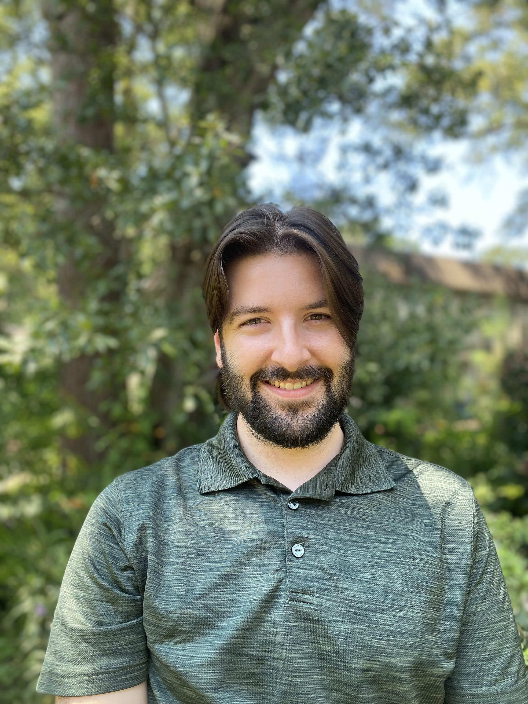

<!-- Header stays unchanged -->

<!-- Bio section: picture on the left, name + description centered to the right -->

  <!-- Bio picture (replace with your own image path) -->
  

    
  

<!-- Name + description centered vertically -->

  <h1 style="margin:0; font-size:2rem;">
    Dennis Houlihan, MSc
  </h1>
  

    Physicist, Data Scientist, and Quant Enthusiast
  

  <a href="/projects/"
     style="padding:0.75rem 1.25rem; border-radius:9999px; border:1px solid; text-decoration:none;">
    Projects
  </a>

  <a href="mailto:dennishoulihan12@gmail.com"
     style="padding:0.75rem 1.25rem; border-radius:9999px; border:1px solid; text-decoration:none;">
    Contact
  </a>
  

  

 <!-- ✅ CLOSE FLEX ROW -->

<!-- ABOUT SECTION -->
<section id="about" class="section-pad-small">
  

    

      <h2>About Me</h2>
      

        I am a <strong>PhD Candidate in Physics</strong> with a focus on applied data science and machine learning. My work involves building and evaluating models on large-scale datasets, quantifying uncertainty, and translating complex quantitative problems into actionable insights. I am currently pursuing industry data science roles.
      

    

  

</section>
